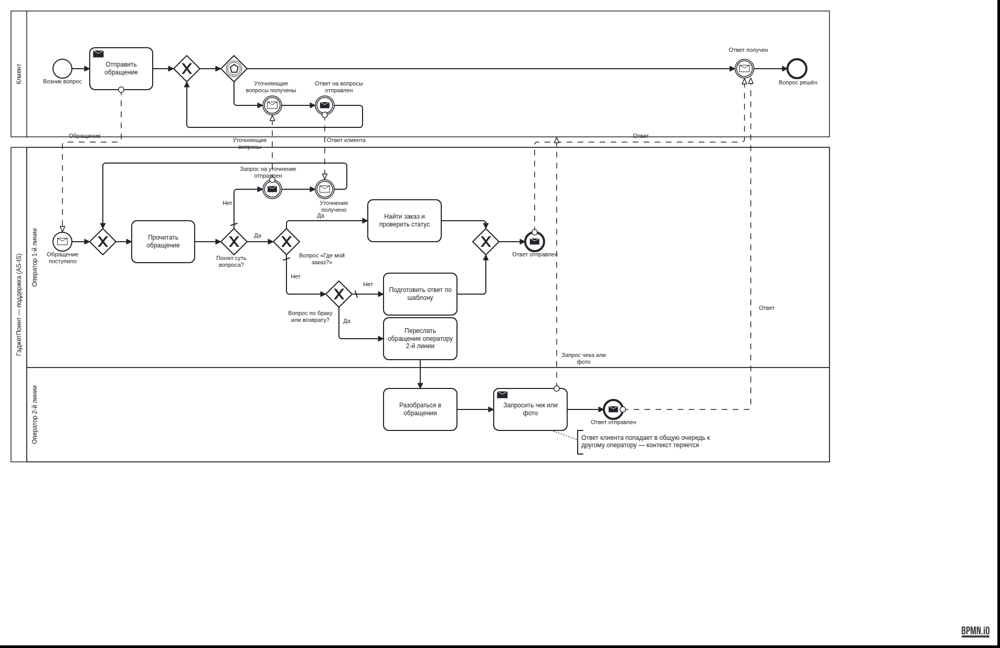
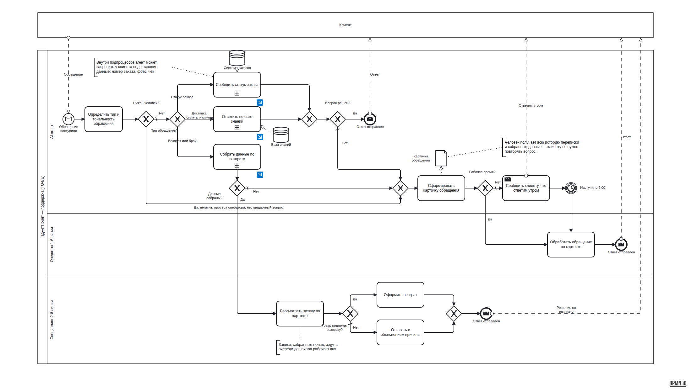
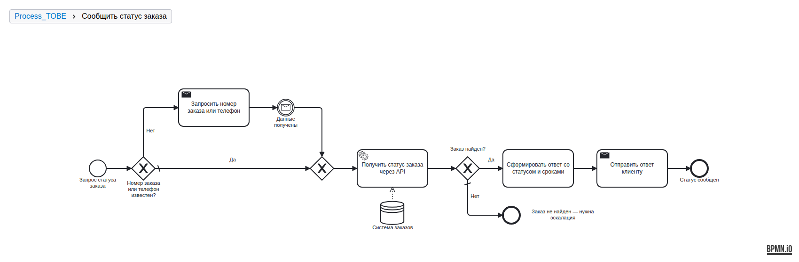
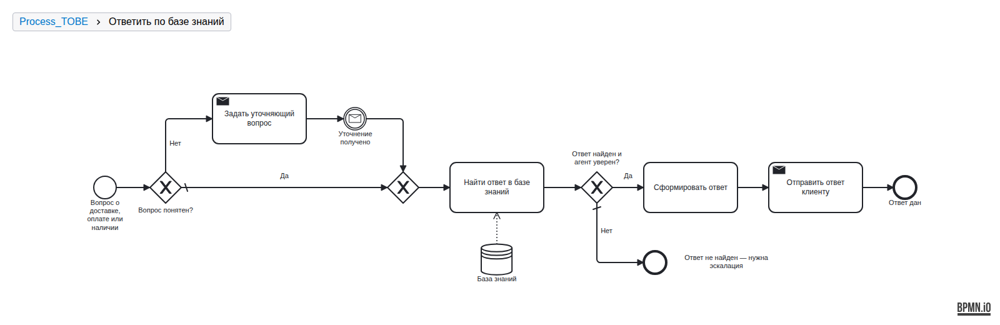
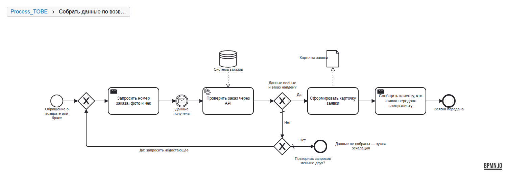
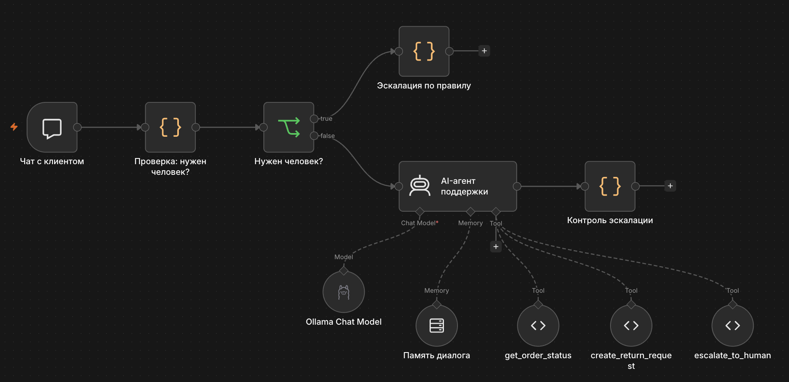

# AI-агент первой линии поддержки для интернет-магазина

Учебный проект полного цикла бизнес-анализа и проектирования AI-агента: от интервью с заказчиком и моделирования процессов до требований, сборки прототипа и тестирования.

**Стек:** BPMN 2.0 · user stories и критерии приёмки · n8n · Ollama (локальная LLM qwen3:8b) · JavaScript

---

## 1. Контекст

«ГаджетПоинт» — вымышленный интернет-магазин электроники в Москве и МО: около 800 заказов и 300 обращений в поддержку в день через чат, email и Telegram. Поддержка — 6 операторов первой линии и 2 специалиста по возвратам, работает с 9:00 до 21:00.

Исходные данные получены из интервью с руководителем поддержки (смоделированного): рассказ о процессе в свободной форме, который нужно было структурировать.

## 2. Анализ текущего процесса (AS-IS)



| № | Проблема | Последствие |
|---|---|---|
| 1 | ~60% обращений типовые, но обрабатываются вручную | Операторы заняты рутиной, растёт очередь |
| 2 | Статус заказа оператор ищет вручную в отдельной системе | Долгая обработка самого частого вопроса |
| 3 | При возврате контекст теряется: повторное сообщение клиента попадает к другому оператору | Клиент повторяет проблему заново |
| 4 | Поддержка не работает с 21:00 до 9:00 | Утренний завал, клиенты ночью без ответа |
| 5 | Среднее время первого ответа ~4 часа | Итоговый показатель проблем 1, 2, 4 |

## 3. Цели

| Метрика | Было | Цель |
|---|---|---|
| Время первого ответа на типовой вопрос | ~4 часа | до 1 минуты |
| Доля обращений, закрытых без человека | 0% | 45–50% |
| Часы работы | 9:00–21:00 | 24/7 (агент) |
| Возвраты, где специалисту пришлось дозапрашивать документы | почти все | < 10% |
| Ответы агента, признанные ошибочными | — | < 5% |

Целевые значения — гипотезы для проверки на пилоте, а не измеренный результат.

## 4. Целевой процесс (TO-BE)



Ключевые решения:

- **Агент принимает все обращения**, классифицирует их и ведёт три сценария: статус заказа, вопросы по базе знаний, сбор данных по возврату.
- **Шлюз «Нужен человек?»** до агента: просьба оператора, негатив и нестандартные вопросы сразу уходят человеку.
- **Карточка обращения** с историей переписки и собранными данными — человек получает контекст, клиент не повторяет вопрос (решает проблему 3).
- **Ночной режим:** агент отвечает круглосуточно, а обращения, требующие человека, ставятся в очередь до 9:00 с уведомлением клиента.
- **Решение по возврату принимает только специалист** — агент собирает данные, но ничего не обещает.

Подпроцессы второго уровня:

| Сообщить статус заказа | Ответить по базе знаний | Собрать данные по возврату |
|---|---|---|
|  |  |  |

Исходник схемы: [`docs/bpmn/to-be.bpmn`](docs/bpmn/to-be.bpmn) — открывается в bpmn.io, Camunda Modeler, Storm BPMN.

## 5. Требования

[`docs/requirements.md`](docs/requirements.md): 6 user stories с критериями приёмки в формате «Дано / Когда / Тогда», нефункциональные требования, допущения и таблица трассируемости «требование ↔ элемент схемы».

## 6. Прототип



```
Чат → [код] Нужен человек? ──да──→ [код] Эскалация по правилу
                         └─нет──→ AI-агент (LLM + память + инструменты) → [код] Контроль эскалации → ответ
```

| Компонент | Реализация |
|---|---|
| Модель | qwen3:8b через Ollama — локально, бесплатно, данные клиентов не уходят во внешние сервисы |
| Логика агента | Системный промпт: [`agent/system_prompt.md`](agent/system_prompt.md) |
| База знаний | [`agent/knowledge_base.md`](agent/knowledge_base.md) |
| Система заказов | Тестовые данные: [`agent/orders.json`](agent/orders.json) — вместо реального API |
| Инструменты агента | `get_order_status`, `create_return_request`, `escalate_to_human` |

### Главное архитектурное решение

**Нейросеть отвечает за понимание вопроса и формулировку ответа, а решения, от которых зависит судьба обращения, проверяет код.**

Это решение появилось из тестов: модель обещала клиенту «передаю специалисту», но не вызывала инструмент эскалации — в реальной поддержке такое обращение никто бы не увидел. Правка промпта не помогла, поэтому:

- явная просьба оператора и резкий негатив распознаются кодом **до** агента;
- после агента стоит **guardrail**: если агент пообещал передачу, но не вызвал инструмент, карточку создаёт код;
- рабочее время, поиск заказа и проверка полноты заявки на возврат — тоже код, а не LLM.

## 7. Тестирование

20 тест-кейсов, каждый привязан к требованию: [`docs/test_cases.md`](docs/test_cases.md).

Найденные проблемы и что с ними сделано:

| Проблема | Решение |
|---|---|
| Модель имитировала эскалацию текстом без вызова инструмента | Правила до агента + guardrail после агента |
| qwen2.5:7b перестала вызывать инструменты (статус заказа, эскалация) | Замена модели на qwen3:8b — инструменты вызываются корректно |
| Внутри длинной сессии неудачный ответ влияет на следующие | Известное ограничение, см. ниже |

## 8. Ограничения и развитие

- **Наличие товара** в MVP берётся из статичной базы знаний; в рабочей версии нужно API склада (вопрос к заказчику).
- **Вложения** (фото товара и чека) в прототипе имитируются текстом — локальная модель не анализирует изображения.
- **Память диалога:** в длинной сессии ранние ошибки влияют на последующие ответы; при внедрении — короче окно памяти или суммаризация.
- **Скорость:** локальная модель на ноутбуке отвечает за несколько секунд; для продакшена — сервер с GPU или облачная модель.
- **Каналы:** прототип работает через встроенный чат n8n; email и Telegram подключаются отдельными триггерами.

## Как запустить

1. Установить [Ollama](https://ollama.com) и скачать модель: `ollama pull qwen3:8b`
2. Запустить n8n:
   ```
   docker run -d --name n8n -p 5678:5678 -e GENERIC_TIMEZONE=Europe/Moscow -e TZ=Europe/Moscow -v n8n_data:/home/node/.n8n docker.n8n.io/n8nio/n8n
   ```
3. Открыть http://localhost:5678, импортировать [`agent/workflow.json`](agent/workflow.json).
4. В блоке модели создать подключение к Ollama с адресом `http://host.docker.internal:11434` и выбрать модель `qwen3:8b`.
5. Нажать **Open chat**.

---

Автор: Тимофей Миронов · [Telegram] @xxxpsixxx
